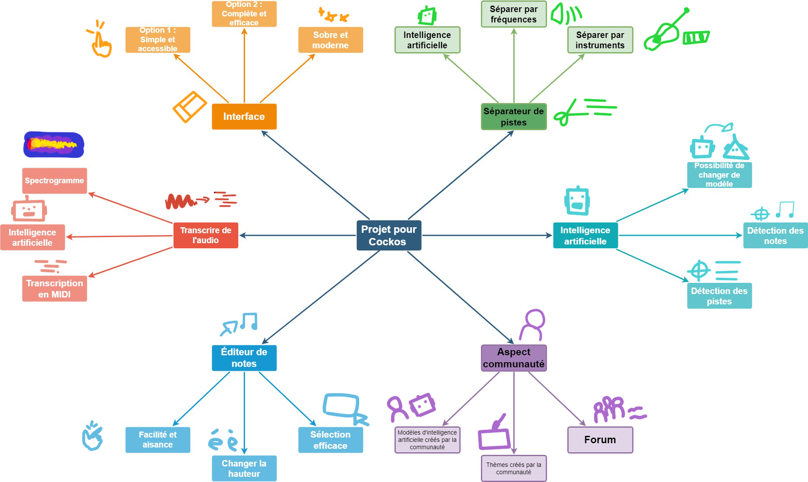

# Entrée 8
## Plan du travail synthèse
Durée: 8 à 10 minutes

### Résumer votre projet en une phrase
Permettre la conversion d'audio en notes MIDI ainsi que la séparation de piste en un seul logiciel.

### Moodboard

### Technologies
Principalement l'intelligence artificielle.

### Tâches
DÉVELOPPEMENT DE L’IA
ENTRAINEMENT DE L’IA PRINCIPALE
INTERFACE UI/UX
ILLUSTRATIONS UI
DÉVELOPPEMENT
DÉBOGAGE
OPTIMISATION
DOCUMENTATION
DÉPLOIEMENT
MAINTEANCE

